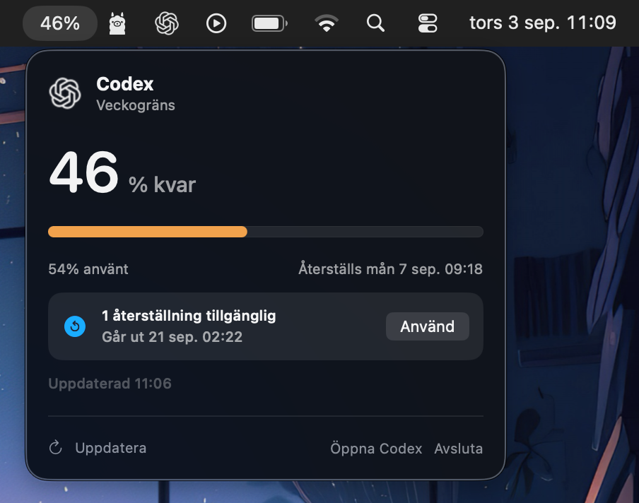

# Codex Usage Bar

A small native macOS app that shows your remaining weekly Codex usage in the menu bar.



It automatically uses the ChatGPT account already signed in to Codex on your Mac. No separate login or API key is needed.

The interface follows your Mac's preferred language: Swedish when the primary language is Swedish, otherwise English.

Available earned resets and their expiration are shown in the app and can be used after confirmation.

> Independent open-source project. Not affiliated with or endorsed by OpenAI.

## Appearance and refresh

The menu bar panel includes a compact **Monster** theme with a dark plum
background, colorful character, and icon-only controls. Hover over controls for
labels; use the palette menu to switch between Monster and Classic. The choice
is saved between launches. Classic retains the original panel layout, labels,
colors, controls, and five-minute refresh interval. To return to Monster from
Classic, right-click the panel and choose **Monster theme**.

The monster reacts to remaining weekly usage:

- **50–100%:** happy, green, and bouncing.
- **20–49%:** peckish and gently moving.
- **1–19%:** pink-orange, sweating and rubbing its hands for more tokens.
- **0%:** purple and asleep.

Animations respect macOS Reduce Motion. Usage refreshes automatically every
60 seconds in Monster (five minutes in Classic); manual refresh remains available. Reset credits still
require confirmation before use.

## Install

1. Download the latest universal ZIP from [Releases](../../releases/latest).
2. Unzip it and move `CodexUsageBar.app` to **Applications**.
3. Open the app. If macOS blocks it, right-click it and select **Open**.

Requires macOS 13 or later and Codex Desktop or Codex CLI. If needed, sign in first with:

```sh
codex login
```

## Build from source

```sh
swift run ParserChecks
./Scripts/build-app.sh
open dist/CodexUsageBar.app
```

## License

The source code is available under the [MIT License](LICENSE).

- [Privacy](PRIVACY.md)
- [Security](SECURITY.md)
- [Third-party notices](THIRD_PARTY_NOTICES.md)

The OpenAI logo is owned by OpenAI and is not covered by the MIT License.
